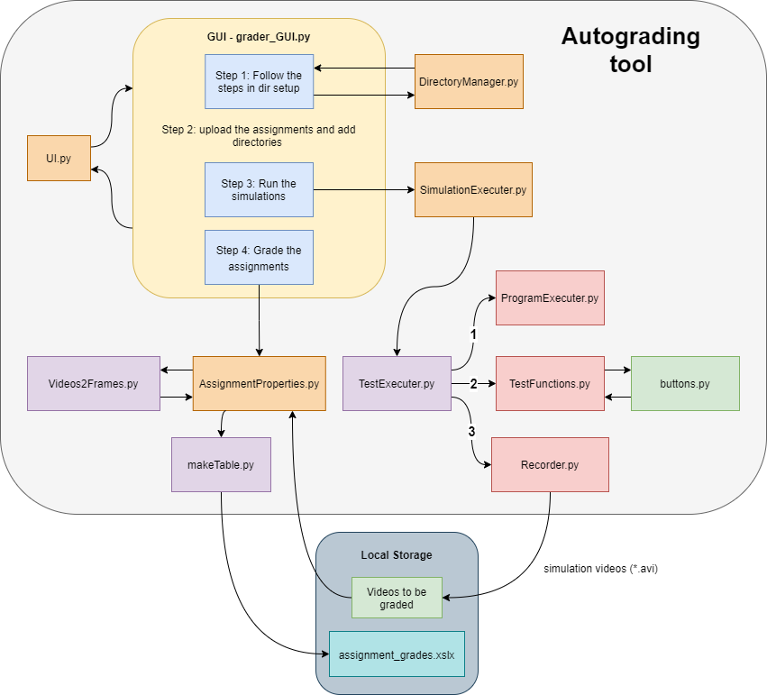
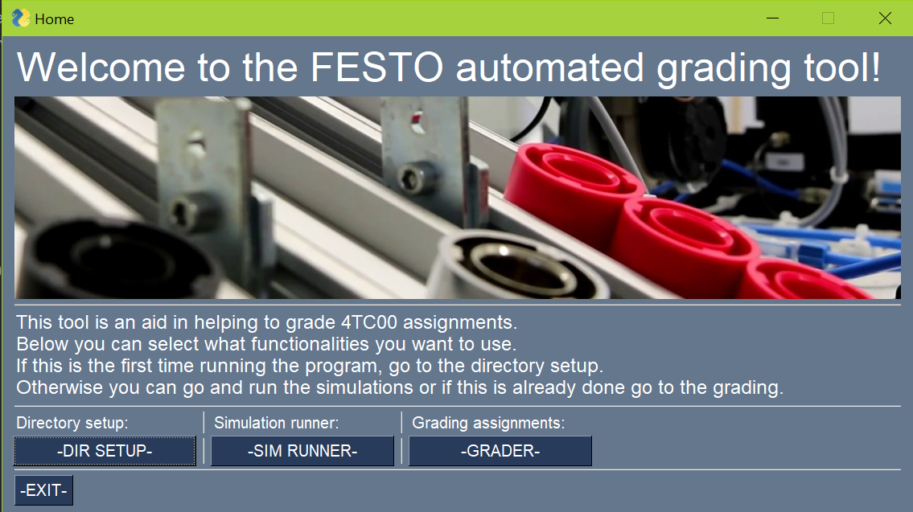
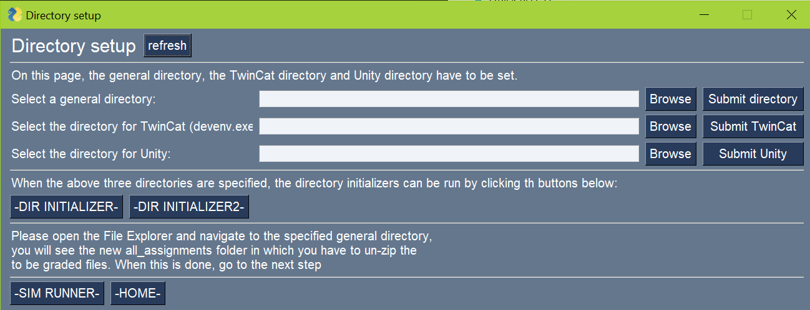
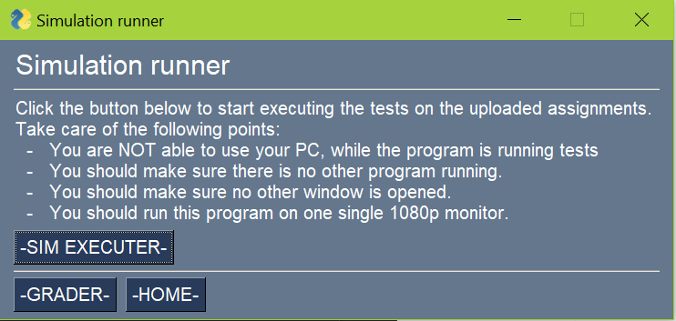
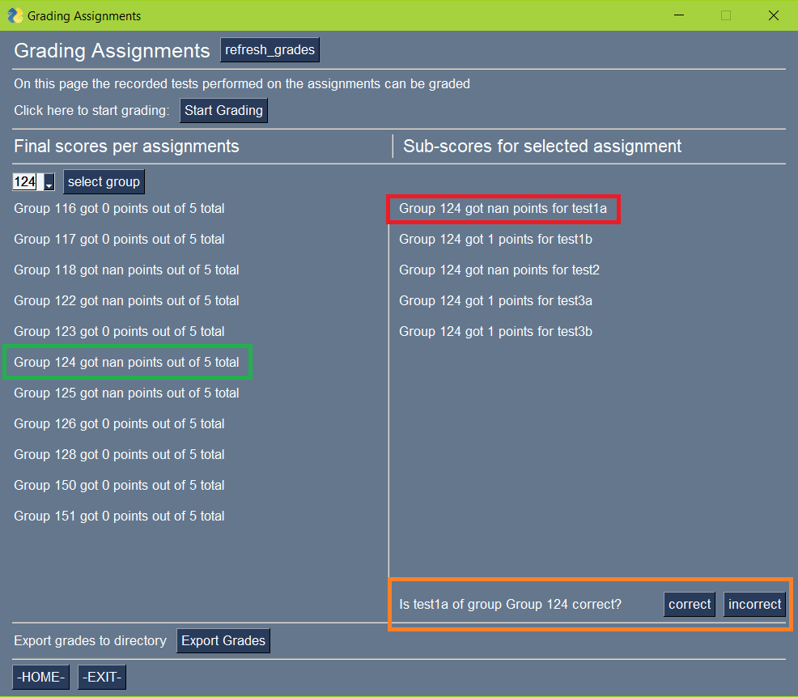
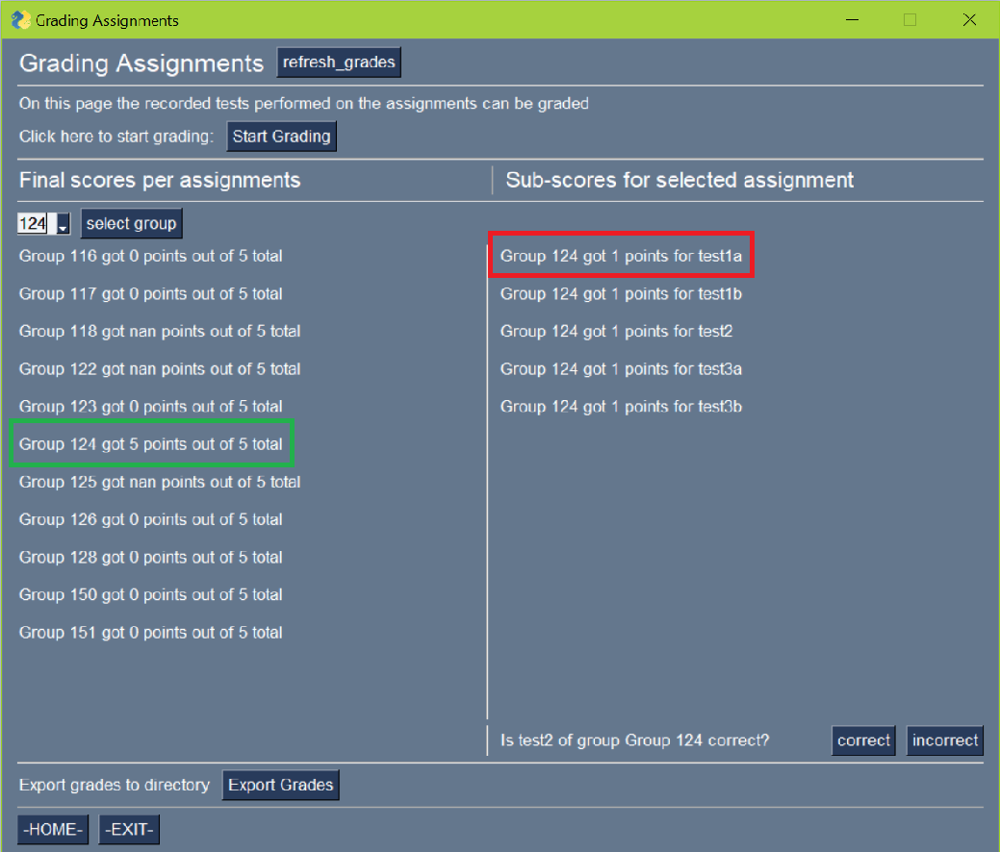
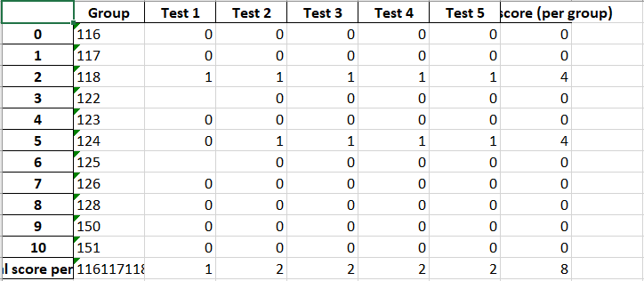

# AutoGraderProject
## Version
Version 1.0.0
## About
This grading tool is developed for a Bachelor End Project at the TU/e. This autograding tool, as it already says, tries to automatically grade assignments. These assigments consist of students having to model and control a plant which has to perform a certain task. The grading tool is made initiate tests on the performance of the controllers, made by the students. These tests are performed in the Digital Twin environment in Unity. The tool will cycle through all supplied assignments, start all the selected tests and record their perfomance. After this performance is recorded, it tests the videos with an already trained Machine Learning algorithm, which determines if the test is performed correctly. All information of an assignment for all different tests combined, results in the grade for the assignement, which is added to a excel file containing all the grades. 

## Installation
- Install a python IDE (Pycharm is used to develop this project) download link: https://www.jetbrains.com/pycharm/download/#section=windows 
- Make sure Python is correctly installed on your PC (Python 3.9 is used to develop this project) 
download link: https://www.python.org/downloads/release/python-395/
  
- Make sure to download all dependencies/libraries, either using pip in the command prompt or within the IDE itself:
  - ctypes
  - cv2
  - functools
  - mss
  - mss.tools
  - numpy
  - openpyxl
  - os
  - pandas
  - psutil
  - pyautogui
  - PysimpleGUI 
  - signal
  - tensorflow
  - time

- Download the separate zip-file containing all the trained machine learning models (contact: b.v.d.rijt@student.tue.nl)
- Clone the project from this GitHub page, or use the download link: https://drive.google.com/file/d/1yiHaQFGUrIWMEMcXo4hBZ4svDCS1LxjJ/view?usp=sharing 
  When clicking this link, the download should start. After downloading, un-zip the folder and look for grader_GUI.exe and run the application.
## Configuration
This chapter is split into two parts, as this tool can be used for grading. But this tool also needs further improvements to make the grading experience and performance even better.
### Use for grading
Follow the steps for the installation and run the grader.exe (to be added). After this application is ran, the application will start itself. Read the steps in "Usage of GradingTool" for an explanation of how to use the grading tool. 

### Use for development
For development one needs an IDE to work with the python scripts. This project is made with PyCharm, but you are free to use whatever you want. The seperate files are made as structured and clean as possible to make it easier to work with.

For development one can adjust the project to improve the performance or handlability of the project. Furthermore one can use the TensorFlowTrainingModle.ipynb file inside the TensorFlowFiles folder to improve the machine learning models or train new models.
This file is made in google colab, the machine learning models are also trained in this environment (https://colab.research.google.com). In google colab one can select the runtime type, which allows acces to powerful GPU's to enhance the training performance for the algorithms.
The google colab file should be self explanatory to use and improve, furthermore google colab and tensorflow is very well documented.

The project in this repository is structured as seen in the figure below.

This figure should help to see the general coherance between the different *.py files/ modules inside this project. The files itself are precisely commented to try and describe the functionalities of all the pieces of code and functions. Furthermore all different files are built up in the same structure to make it easier to work with and to find certain things. 

It is advised that before starting to work with the grading tool, to have a general knowledge of the Python programming languege. Specifically the PysimpleGUI library might need some further explanation. For some parts of the project OOP (object oriented programming) is used, which also might need some explanation. For the larger part of the project functional programming is used. For the TensorFlow part of the assignment one might want to read into Machine Learning and specifically into the keras module of TensorFlow.

## Usage of GradingTool
First the guide for the GUI will be discussed. When running the application, the Home screen listed in the figure above will pop up. From here you have the following options:
1. Home
2. Directory Setup
3. Simulation Runner
4. Grader

When this is the first time using the grading tool, go to the Directory Setup, when doing this, the following window will pop up.

Follow the steps in the GUI and add a general directory, also add the path to TwinCat (devenv.exe) at last add the Unity simulation path.
After this press the buttons to initialize the selected directory to make it ready for use.
Now to the folder "all_assignments" add all the unzipped assignments you want to grade.
To the folder "ml_models" add the trained machine learning models.

When this step is finished go to the simulation runner, which will show the following window.

Carefully read the notes listed in this GUI to make sure no problems are caused while testing. This process may take a few hours so make sure you don't need your pc for this duration. When the simulation process is finished, navigate to the grader, which will show the following window.

In this window press start grading, to start the grading process. After this is finished, the final grades will pop up on the left. To see the scores for the individual tests per assignments, select a group on the left and the scores will show on the right as seen in the image. If one thinks it is necessary, you can export the grades to a text file using the Export Grades button.

As seen in the green and red rectangle, some scores still have 'nan' as a score, which means the algorithm could not predict these tests with a high enough accuracy. In the orange rectangle the question is asked whether these tests are correct or incorrect. To answer this question, navigate to the all_simulations folder in the chosen directory and select the specified video. Play back the video and see if the test is computed correct or incorrect. Click the corresponding button and the values will be updated as seen in the image of the GUI below.

Finally the grades may be exported to an excel (*.xlsx) file to have a neatly organised table with all the results. It shows all sub-scores and final scores per group. It also shows the total points of all assignments for one test and the overall total points scored, these two results might come in handy when analysing the general performance of students. An example of the excel file is seen in the figure below.

## Points of improvement

- First of all, the simulation execution process is not ideal. This takes about 2 hours to complete for 11 assignments. I think this should be made shorter, the minimal possible time to achieve is about 30 minutes. The way to tackle this problem is by defining another method of executing the tests. Now the program has to restart TwinCat and Unity for every test for every group, which means it has to do this 55 times.
- Furthermore it was seen that the trained machine learning model for test2 didn't show as nice of results as the other trained models. This is probably because this test was harder to judge. This is the test that tests the correct order of products. 
This problem can possibly be tackled by adding more data (which is hard in this case as data is scarce and there should be data left to test and validate the models). Another way to tackle this problem is by using another shape of machine learning model i.e. different layers, different numbers of filters, etc.
  
- At last, tests for more aspects of the system should be added, so the grading tool can grade larger parts of the assignments. 

